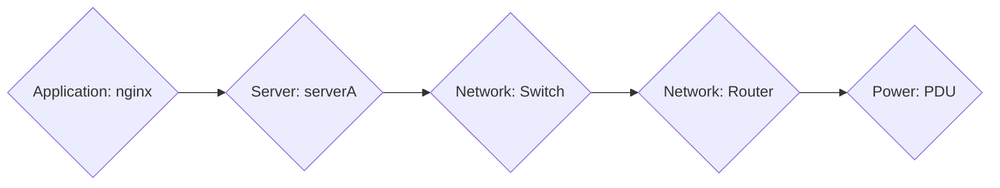
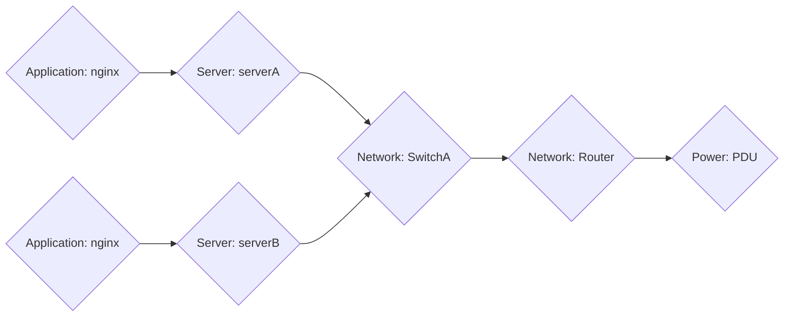
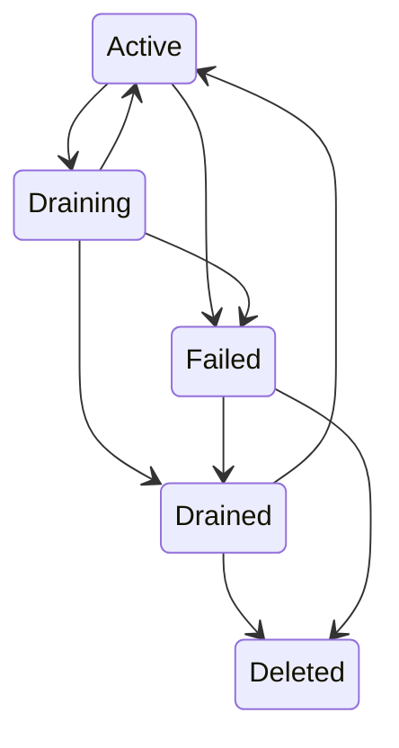

# Building The Graph

## Layers

At the heart of it, every deployment infrastructure can be thought of in layers. These layers build up the environment.
These layers represent isolated components of the system. They also represent barriers that can not be crossed during
during deploys. The layers are:

1. Power
2. Network
3. Server
4. Application

This heirarchical order represents how failures and configuration changes trickle down. For example, if you cut the
power it will kill your networking, which kills access to your servers, which kills access to your application. If you
shutdown your servers, you lose access to your application but your network layer and power are still intact. If you
introduce a bug in your software, your program may go down, but you retain access to everything else. In the end,
application availability is the objective but it shows the trickle-down effect that changes can have.

## Nodes

Each layer will have collections of nodes of varying types. For example, Power nodes could be circuit breakers, PDUs,
generators, or a power source such as the grid. Network nodes could be a router or a top of rack switch. Servers could
be full chassis servers, or individual blades in an enclosure. Applications could be webservers or databases. All nodes
have dependencies on at least 1 node of each higher tier (ex. servers need at least one source of network and one source
of power) and potentially on ones of an equal tier (ex. blade servers may rely on an enclosure, a backend service might
need a database)

## The Graph

Now that you have nodes you can start to form a structure of them. More specifically, you should be able to form an
acyclic directed graph. Take this example of nodes:

Notice the nodes follow layer order, and if you were to kill an element from anywhere all elements to the right would
logically go as well. Now imagine if we add a few more nodes to this:

In this example, we removed the single point of failure of the server and increased the fault tolerance of our system.
Obviously in this example the switch, router, and power are still single points of failure, but they can be improved in
the same way. Mapping these relationships allows operators and tooling to make informed decisions when performing
maintenance, doing upgrades, as well as where to invest in improvements for fault tolerance.

## Node States

Every node in the system can be in one of several different states:

- Active
- Draining
- Drained
- Failed
- Deleted

Nodes move between these states:

These state movements can happen by an operator action as well as automatic detection systems. Node states apply to
dependent nodes as well. For example, if a server goes into a draining state it can't complete draining until all
applications on it move to a drained state. If a server moves to failed, all applications on it move to failed as well.
